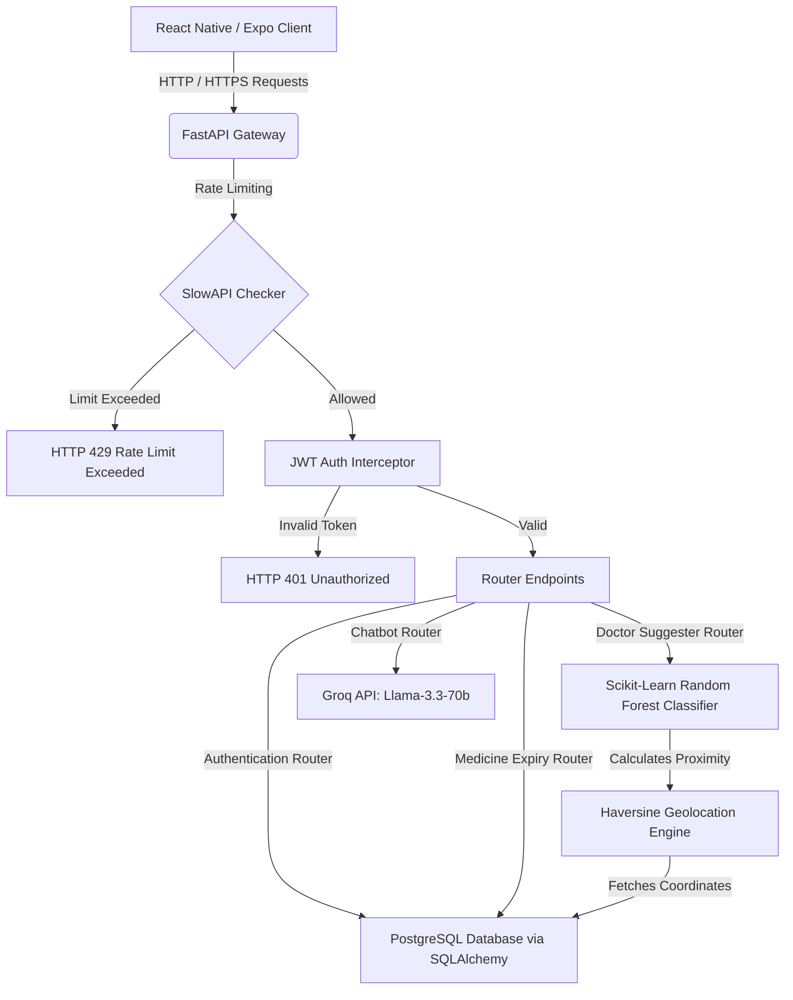

# CureConnect (MediCheck) - Project Review Study Guide & System Architecture
**Date of Review**: July 29, 2026
**Ecosystem Name**: CureConnect (App named MediCheck)
**Target Platforms**: Cross-Platform Mobile (Android & iOS) + Web Browser Support

---

## 📱 1. Executive Summary & Value Proposition

CureConnect (MediCheck) is a state-of-the-art, secure, and AI-powered digital healthcare management ecosystem designed to bridge the gap between patients, medical professionals, and AI-driven clinical insights. 

The application addresses critical challenges in modern healthcare management:
1. **Clinical Accessibility**: Provides users with a 24/7 AI-powered chatbot and symptom-to-specialist analyzer.
2. **Doctor-Patient Bridging**: Facilitates location-based doctor search and appointment bookings, sorting doctors dynamically by proximity using coordinate mathematics.
3. **Medication Safety**: Scans drug barcodes/manual entries, checks safety instructions, and coordinates automated local notifications so patients never miss their schedules or consume expired medication.
4. **Family Health Network**: Enables users to manage health profiles, track check-ins, and schedule medical appointments for multiple family members under a single, unified database.

---

## 🛠️ 2. Comprehensive Technology Stack

The project utilizes a highly decoupled, modern service-oriented architecture:

| System Layer | Technology / Library | Specific Version / Type | Purpose & Technical Advantage |
| :--- | :--- | :--- | :--- |
| **Frontend Core** | React Native / React Web | `react-native-web@0.21.0` | Allows a single JavaScript codebase to run natively on mobile and load as a responsive web app. |
| **Frontend Framework**| Expo SDK | `expo@54.0.35` | Simplifies access to native device APIs (camera, location, local notifications) without writing complex Java/Objective-C code. |
| **State Management**  | Zustand | `zustand@5.0.12` | Extremely lightweight state store. Eliminates Redux boilerplates, providing rapid, hook-based state synchronization. |
| **Navigation**        | React Navigation | `react-navigation/native` | Handles screen transition animations and tab-stack-drawer hierarchies smoothly. |
| **API Client**        | Axios | `axios@1.13.6` | Handles HTTP client requests to the FastAPI backend, utilizing interceptors for appending secure bearer tokens. |
| **Device Hardware**   | Expo Camera | `expo-camera@17.0.10` | Initiates hardware camera access to scan medicine packages and medicine barcodes. |
| **Geolocation/Maps**  | React Native Maps | `react-native-maps@1.20.1` | Displays clinic addresses, lists hospitals, and obtains the user's location via GPS (`expo-location`). |
| **Notifications**     | Expo Notifications | `expo-notifications@0.32.17` | Schedules recurring local push notifications for medication timing, even when offline. |
| **Accessibility**     | Expo Speech | `expo-speech@14.0.8` | Reads out instructions and chatbot advice loud for visually impaired users. |
| **UI Aesthetics**     | Lottie & SVGs | `lottie-react-native` / `react-native-svg` | Renders high-quality vector icons and smooth Lottie micro-animations for premium UX. |
| **Backend Core**      | FastAPI | `fastapi` | High-performance, highly asynchronous Python web framework built on top of Starlette and Pydantic. |
| **ASGI Server**       | Uvicorn | `uvicorn` (standard) | High-speed Asynchronous Server Gateway Interface for running the Python FastAPI app. |
| **ORM Layer**         | SQLAlchemy | `sqlalchemy` | Object-Relational Mapper that abstracts SQL queries into Python objects, preventing SQL injections. |
| **Database**          | PostgreSQL | `psycopg2-binary` | Enterprise-grade Relational Database Management System (RDBMS) for storing robust transactional data. |
| **Rate Limiter**      | SlowAPI | `slowapi` | Restricts rapid endpoint hitting (DDoS mitigation) based on IP address tracking. |
| **Security / Auth**   | PyJWT & Hashlib | `pyjwt`, `hashlib.sha256` | Handles stateless user authentication using JSON Web Tokens. Hashes passwords securely in the DB. |
| **AI LLM Engine**     | Groq Cloud SDK | `groq` | Interfaces with Llama models hosted on Groq Cloud for near-instant responses. |
| **AI Chatbot Model**  | Llama 3.3 | `llama-3.3-70b-versatile` | State-of-the-art LLM model used for conversational healthcare support. |
| **Predictive ML**     | Scikit-Learn | `scikit-learn` | Used to build, train, and serialize the custom Random Forest specialist classification pipeline. |

---

## 🏛️ 3. Backend Architecture & Core Workflows

The backend architecture is structured around standard service-oriented principles. The codebase is organized cleanly to allow scalability, ease of testing, and modular separation of concerns.

### Directory Structure
```
d:/cureconnect-backend/
├── app/
│   ├── main.py              # Application entrypoint & CORS/Limiter setup
│   ├── database.py          # PostgreSQL engine, session initialization, Base model
│   ├── models/
│   │   └── models.py        # SQLAlchemy schema definitions
│   ├── schemas/             # Pydantic schemas for data validation
│   ├── routers/
│   │   ├── auth.py          # Login, Register, Profile, OTP and Reset routes
│   │   ├── appointments.py  # Appointment booking & status management
│   │   ├── medicines.py     # Med details, saving, and expiry alerts
│   │   ├── doctors.py       # Distance-based and ML-based doctor suggestions
│   │   ├── family.py        # Family member profiles & health statuses
│   │   ├── symptoms.py      # Rule-based symptoms and specialist mapping
│   │   ├── users.py         # Profile fetching
│   │   └── chatbot.py       # Groq-based Llama AI chatbot assistant
│   └── utils/
│       ├── auth.py          # JWT Creation & Verification utilities
│       └── email.py         # OTP generator and SMTP mail dispatcher
├── train_model.py           # Training pipeline for the classifier
├── ml_model.pkl             # Serialized Random Forest model artifact
└── requirements.txt         # Package dependencies
```

### Core Architecture Highlights



### Core Backend Workflows & Technical Implementations

#### 1. Security & Authentication Flow
- **Registration & Hashing**: When a user registers (`POST /api/auth/register`), the password undergoes a cryptographic one-way hash using SHA-256 (`hashlib.sha256(password.encode()).hexdigest()`). The hashed string is persisted in the PostgreSQL database.
- **JWT Session Tokens**: Upon authentication (`POST /api/auth/login`), the server signs a JSON Web Token (JWT) containing the `user_id` and `email` using a secret key and the HS256 algorithm.
- **Stateless Authorization**: All protected endpoints rely on a dependency-injection pattern `Depends(verify_token)`. The backend extracts, decodes, and verifies the signature of the Bearer token before proceeding, maintaining a secure, stateless execution environment.
- **OTP Password Recovery**: Includes an SMTP-based password reset system. It generates a 6-digit random code, caches it with an expiration timestamp, mails it to the user via a SMTP client, and allows updates to the user credentials once verified.

#### 2. AI Specialist Predictor (Scikit-Learn + Random Forest Classifier)
The `train_model.py` script builds a text classification pipeline to map user-inputted symptoms to the correct doctor specialty.
- **Data Representation**: Raw symptoms strings are transformed into numerical vectors using a `TfidfVectorizer`. It uses an `ngram_range=(1, 2)` to capture phrases (e.g. "chest pain" or "high fever"), converts input to lowercase, and strips out English stop words.
- **Model Engine**: A `RandomForestClassifier` with 200 trees (`n_estimators=200`), a maximum depth of 15 (`max_depth=15`), and a balanced class weight config (`class_weight='balanced'`) trains on the vector spaces.
- **Production Inference**: The trained pipeline is serialized into `ml_model.pkl` via Python's `pickle`. At runtime, `app/routers/doctors.py` loads this model. When a user queries `/api/doctors/suggest?symptoms=...`, the model parses the phrase, returns the predicted classification category (e.g., "Cardiologist"), and computes the probability confidence score.
- **Keyword Fallback**: If the pickle file is missing or fails to load, the router falls back to a regex keyword-matching lookup database to ensure high availability.

#### 3. Geolocation & Proximity Engine (Haversine Formula)
Once the correct specialist category is determined by the ML model, the backend matches them with nearby physicians using the **Haversine Formula**.
This algorithm calculates the shortest great-circle distance between two coordinate pairs on the Earth's surface (spherical model):

$$d = 2R rcsin\left(\sqrt{\sin^2\left(rac{\Delta \phi}{2}
ight) + \cos(\phi_1)\cos(\phi_2)\sin^2\left(rac{\Delta \lambda}{2}
ight)}
ight)$$

Where:
- $\phi_1, \phi_2$ are the latitudes of the user and the doctor (in radians).
- $\Delta \phi$ is the latitude difference, and $\Delta \lambda$ is the longitude difference.
- $R$ is the Earth's radius (6371 kilometers).
- $d$ is the calculated distance.

The API dynamically queries the database for doctors matching the predicted specialization, executes the Haversine function on the result set, sorts them in ascending order of distance, and returns the closest clinical profiles.

#### 4. Groq-Powered AI Chatbot (Llama 3.3)
For open-ended conversational health questions, the app hits `/api/chatbot/chat`.
- The route acts as a secure intermediary layer, keeping private API credentials hidden on the server.
- It formats requests into a conversational payload containing a strict system prompt: *"You are CureConnect AI, a helpful healthcare assistant. Give short, safe medical guidance."*
- It calls the Groq Cloud API, fetching responses from `llama-3.3-70b-versatile` and returning the reply to the user in less than a second.

#### 5. Medicine Scanner & Expiry Alerts Engine
- **Barcodes & Metadata**: Matches scanned barcode IDs or text searches to load generic names, dosage instructions, and known side effects.
- **Smart Expiry Calculations**: The backend evaluates stored date entries in the format `MM/YYYY` against the current server time:
  ```python
  month, year = med['expiry'].split('/')
  expiry_date = datetime(int(year), int(month), 1)
  days_left = (expiry_date - datetime.utcnow()).days
  ```
  If `days_left <= 60`, the item is marked as `expiring_soon` or `expired` (if negative), allowing the frontend to trigger dashboard alerts and send warning emails.

---

## 💾 4. Database Models & Schema Design

The system runs on five normalized database models designed using SQLAlchemy classes:

### 1. `User` Table
Tracks registered application users and personal health metrics.
- `id` (String, Primary Key)
- `name` (String, Required)
- `email` (String, Unique, Index, Required)
- `password` (String, SHA-256 Hashed, Required)
- `phone` / `age` / `gender` (Strings)
- `height` / `weight` / `blood_group` (Strings)
- `allergies` / `conditions` / `emergency_contact` (Strings)
- `is_active` (Boolean)
- Relationships: Has many `appointments`, `medicines`, `family_members`, and `symptom_checks`.

### 2. `Appointment` Table
Stores booking logs for consultation scheduling.
- `id` (Integer, Primary key)
- `user_id` (ForeignKey linking to `users.id`)
- `doctor_name` (String, Required)
- `specialization` / `hospital` / `area` (Strings, Required)
- `date` / `time` (Strings, Required)
- `fee` / `phone` (Strings, Required)
- `status` (String, defaults to "confirmed")
- `notes` (Text, optional)

### 3. `Medicine` Table
Maintains active prescriptions and schedules.
- `id` (String, Primary Key)
- `user_id` (ForeignKey linking to `users.id`)
- `name` (String, Required)
- `generic` / `manufacturer` / `category` (Strings)
- `barcode` (String, optional)
- `expiry` (String, e.g. "08/2026", Required)
- `reminder_times` (String representation of scheduled times)
- `side_effects` (Text)
- `is_active` (Boolean)

### 4. `FamilyMember` Table
Supports child/parent/spouse tracking.
- `id` (String, Primary Key)
- `user_id` (ForeignKey linking to `users.id`)
- `name` (String, Required)
- `age` / `relation` / `phone` (Strings)
- `blood_group` / `conditions` / `medicines` (Strings/Text)
- `last_check_in` (DateTime, tracks wellness)
- `check_in_note` (Text)

### 5. `SymptomCheck` Table
Maintains audit logs of diagnostic activities.
- `id` (String, Primary Key)
- `user_id` (ForeignKey linking to `users.id`)
- `symptoms` (Text, Raw symptom query)
- `condition` (String, ML Predicted diagnosis)
- `specialist` (String, Predicted specialist)
- `severity` (String, e.g. "Mild", "Moderate")
- `confidence` (Float, ML model confidence score)
- `advice` (Text, treatment instructions)

---

## 🧪 5. Testing Framework & CI/CD Pipeline

To ensure enterprise-grade stability, the system uses a tiered testing hierarchy:

1. **Unit Testing**: Tests FastAPI routers, models, and utility handlers using simulated db contexts (`pytest`).
2. **E2E Web Automation (Selenium)**: Automates Chrome/Firefox browser interactions on the React Native Web build, validating login, profile saving, and doctor searching.
3. **E2E Mobile Automation (Appium)**: Automates native actions on Android APKs. It handles input typing, keyboard dismissals, and permission dialogs on physical or virtual devices.
4. **Test Report Generator**: A specialized script (`generate_400_tests.py` / `scratch_generate_excel.py`) that exports 2,400 comprehensive test cases (400 cases per category: Selenium, Appium, Unit, Validation, Deployment, and Load testing) to a single, formatted Excel workbook to satisfy QA logs and project compliance audits.

---

## 💡 6. Answers to Common Viva / Panel Questions

1. **Why FastAPI instead of Flask or Django?**
   *FastAPI is asynchronous (built on ASGI/Starlette), offering near-NodeJS performance. It validates payloads automatically using Pydantic, preventing illegal inputs before they hit database queries, and auto-generates interactive API documentation, which speeds up frontend-backend integration.*

2. **How does the ML Model suggestion improve over simple keyword matching?**
   *Keyword matching fails on synonyms or descriptive inputs (e.g., "my chest feels extremely tight and heavy" vs "chest pain"). The TF-IDF Vectorizer extracts phrase relationships (bigrams), and the Random Forest model analyzes decision path trees, providing a confidence percentage. If the confidence is low, it safely routes to a General Physician.*

3. **How are medication reminders handled?**
   *The app uses a hybrid model. The backend stores the reminder times (e.g., "09:00, 21:00"). When the app syncs, `expo-notifications` schedules recurring local device alerts. This ensures reminders fire precisely on time even if the user has no network connection.*

4. **Why use Zustand instead of Redux?**
   *Redux requires actions, reducers, and dispatch boilerplate, making it bloated for mobile apps. Zustand is a hook-based state store with zero boilerplate, supporting easy selector hooks. It is optimized for React Native and renders only when specific state fields update.*

5. **How is security handled for patient records?**
   *Auth routes use HTTPS encryption. Database passwords are hashed using SHA-256 (cannot be reversed). Requests require standard JWT access tokens. Also, SlowAPI prevents brute-force login attempts by tracking and limiting endpoint requests.*
